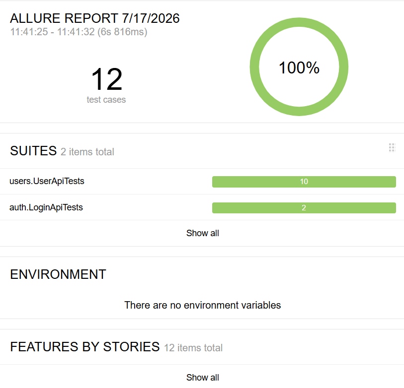
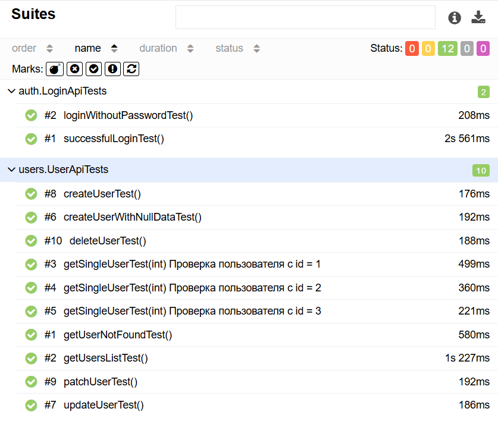
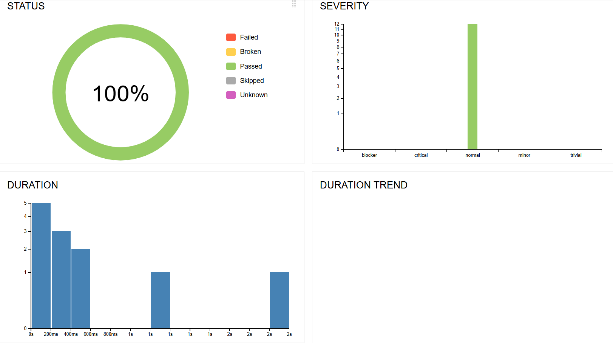

# ReqRes API Autotests

## About the project

This project contains automated API tests for the ReqRes REST API.

The purpose of this project is to practice API automation testing using Java, Rest Assured and JUnit 5.

The project includes positive and negative API test scenarios for user management and authentication endpoints.

---

## Technologies

- Java 17
- Maven
- Rest Assured
- JUnit 5
- Jackson
- Allure Report
- Git / GitHub

---

## Project structure
ReqRes_API_Autotests
│
├── src
│ │
│ ├── main
│ │ ├── java
│ │ │ ├── config
│ │ │ │ └── Config.java
│ │ │ │
│ │ │ └── models
│ │ │ ├── CreateUserRequest.java
│ │ │ ├── CreateUserResponse.java
│ │ │ ├── UpdateUserRequest.java
│ │ │ ├── UpdateUserResponse.java
│ │ │ ├── PatchUserRequest.java
│ │ │ ├── PatchUserResponse.java
│ │ │ ├── LoginRequest.java
│ │ │ ├── LoginResponse.java
│ │ │ └── ErrorResponse.java
│ │ │
│ │ └── resources
│ │ └── config.properties.example
│ │
│ └── test
│ ├── java
│ │ ├── base
│ │ │ └── BaseTest.java
│ │ │
│ │ ├── users
│ │ │ └── UserApiTests.java
│ │ │
│ │ └── auth
│ │ └── LoginApiTests.java
│ │
│ └── resources
│ └── allure.properties
│
├── pom.xml
└── README.md

---

## Covered API scenarios

### Users API

Implemented automated tests for:

- Get single user (GET)
- Get list of users (GET)
- Create user (POST)
- Update user (PUT)
- Partial update user (PATCH)
- Delete user (DELETE)

### Authentication API

Implemented automated tests for:

- Successful login
- Login with invalid credentials
- Validation of error responses

---

## Test features

The project includes:

- Request and response specifications
- Response status code validation
- JSON body validation
- Object mapping with Jackson
- Parameterized tests using JUnit 5
- Allure reporting integration
- API request and response logging

---

## How to run tests

### Clone repository

```bash
git clone https://github.com/your_username/ReqRes_API_Autotests.git
```

### Navigate to project folder
cd ReqRes_API_Autotests

### Run tests with Maven
mvn clean test

---

## Allure Report

The project uses Allure Report for test reporting.

### Generate Allure report:

allure serve target/allure-results

The report contains:

Test execution results
Passed and failed tests
Execution time
API request details
API response details

### Allure screenshots

#### Test execution overview



#### Test Suites



#### Graphs



---

## Configuration

Before running tests, create a file:

src/main/resources/config.properties

Use:

config.properties.example

as a template.

Example:

base.url=https://reqres.in
api.key=YOUR_API_KEY

The real API key is not stored in the repository.

## Dependencies

Main project dependencies:

Rest Assured — API automation framework
JUnit 5 — test framework
Jackson — JSON serialization/deserialization
Allure — test reporting

---

## Author

Janat